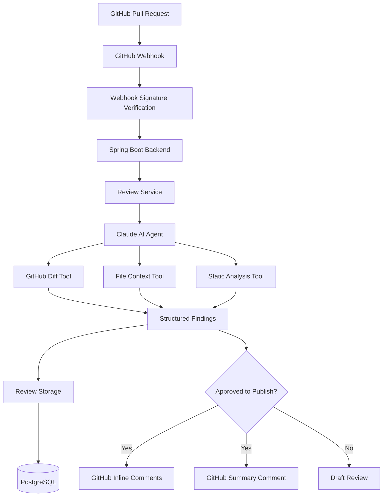

# 🛡️ CodeSentinel
### AI-Powered GitHub Pull Request Code Reviewer

<p align="center">
  <strong>Review Smarter. Catch Bugs Earlier. Ship Safer Code.</strong>
</p>

<p align="center">
  An AI-powered code review agent that analyzes GitHub Pull Requests, identifies potential bugs and security vulnerabilities, and delivers actionable code review feedback using Claude and Java.
</p>

<p align="center">
  
  
  
  
  
  
</p>

---

## 📌 Overview

**CodeSentinel** is an AI-powered GitHub Pull Request review system designed to help developers identify potential code problems before merging changes.

It integrates GitHub webhooks with a Java Spring Boot backend and a Claude-powered AI agent to analyze code changes, investigate additional file context, and generate structured findings.

CodeSentinel is designed to support automated review workflows while giving developers control over when feedback is published to GitHub.

### 🎯 The Problem

Manual code reviews can be time-consuming, and important bugs or security concerns may be overlooked during development.

### 💡 The Solution

CodeSentinel automates the initial review process by examining pull request changes, evaluating potential risks, and preparing clear, actionable feedback for developers.

---

## ✨ Key Features

- 🤖 **AI-Powered Code Reviews** — Analyze pull request changes using Claude.
- 🐛 **Bug Detection** — Identify potential logic errors and correctness issues.
- 🔐 **Security Analysis** — Look for risks such as SQL injection, unsafe input handling, and hardcoded secrets.
- 🧠 **Context-Aware Analysis** — Retrieve complete file contents when diffs alone are insufficient.
- 🧰 **Agent Tools** — Give the AI agent access to pull request diffs, file contents, static analysis, and review-posting operations.
- 📍 **Inline Review Comments** — Attach actionable findings to relevant changed lines.
- 📝 **Review Summaries** — Generate an overall verdict and a severity breakdown.
- 🛡️ **Draft Review Workflow** — Keep reviews in draft mode until explicitly approved.
- 🗃️ **Review History** — Persist reviews and findings in PostgreSQL.
- 📂 **File Filtering** — Skip oversized, binary, and lock files.
- 🔏 **Webhook Verification** — Validate GitHub webhook signatures using HMAC-SHA256.
- 🐳 **Docker Support** — Run the application and PostgreSQL with Docker Compose.

---

## 🏗️ System Architecture



---

## ⚙️ Technology Stack

| Technology | Purpose |
|---|---|
| Java 21 | Backend programming language |
| Spring Boot 3.x | REST APIs and application framework |
| Maven | Build and dependency management |
| LangChain4j | AI agent and tool integration |
| Claude via Anthropic API | AI-powered code analysis |
| GitHub API library | Pull request and repository integration |
| Spring Data JPA | Database persistence |
| PostgreSQL | Review and finding storage |
| Docker | Application containerization |
| Docker Compose | Local application and database orchestration |
| JUnit and Mockito | Automated testing |

---

## 📁 Project Structure

```text
CodeSentinel/
├── src/
│   ├── main/
│   │   ├── java/com/codesentinel/
│   │   │   ├── agent/
│   │   │   │   ├── ReviewAgent.java
│   │   │   │   └── AgentTools.java
│   │   │   ├── config/
│   │   │   │   ├── AnthropicConfig.java
│   │   │   │   └── GitHubConfig.java
│   │   │   ├── controller/
│   │   │   │   ├── WebhookController.java
│   │   │   │   └── ReviewController.java
│   │   │   ├── model/
│   │   │   │   ├── Review.java
│   │   │   │   ├── Finding.java
│   │   │   │   └── Severity.java
│   │   │   ├── repository/
│   │   │   │   └── ReviewRepository.java
│   │   │   ├── service/
│   │   │   │   ├── GitHubService.java
│   │   │   │   ├── StaticAnalysisService.java
│   │   │   │   └── ReviewService.java
│   │   │   └── CodeSentinelApplication.java
│   │   └── resources/
│   │       └── application.yml
│   └── test/
├── .env.example
├── .gitignore
├── Dockerfile
├── docker-compose.yml
├── mvnw
├── mvnw.cmd
├── pom.xml
└── README.md
```

*The structure above describes the intended architecture; adjust filenames to match the implementation in your repository.*

---

## 🔄 How It Works

1. **Pull Request Event:** GitHub sends a webhook when a pull request is opened or updated.
2. **Signature Verification:** CodeSentinel verifies `X-Hub-Signature-256` before processing the event.
3. **Diff Retrieval:** The backend retrieves changed files and their diffs using the GitHub API.
4. **AI Analysis:** Claude reviews the changes and requests additional context through agent tools when necessary.
5. **Static Analysis:** The application runs its available static-analysis checks.
6. **Structured Findings:** Findings include severity, file path, line number, explanation, and suggested fix.
7. **Draft or Publication:** By default, the review is saved as a draft. An authorized approval action triggers publication.
8. **Persistence:** Reviews and findings are stored in PostgreSQL.
9. **Developer Feedback:** Published reviews contain inline comments and an overall summary.

---

## 🚦 Finding Severity

| Severity | Meaning |
|---|---|
| 🔴 CRITICAL | A potentially severe security or correctness issue requiring urgent attention |
| 🟠 MAJOR | A significant bug, risk, or reliability concern |
| 🟡 MINOR | A lower-impact issue or improvement |

CodeSentinel should report only issues supported by evidence in the code. It should not invent findings when the code appears correct.

---

## 🧰 Agent Tools

| Tool | Responsibility |
|---|---|
| `getPullRequestDiff` | Retrieve changed files and pull request diffs |
| `getFileContent` | Retrieve additional file context |
| `runStaticAnalysis` | Run supported static-analysis checks |
| `postReviewComment` | Publish an inline review comment |
| `postReviewSummary` | Publish the overall review summary |

The agent uses a bounded tool-call loop to prevent uncontrolled tool execution. Individual tool errors should be handled gracefully.

---

## 🚀 Getting Started

### Prerequisites

Install the following:

- Java 21
- Maven 3.9+ or use the included Maven wrapper
- Docker Desktop with Docker Compose
- A GitHub account and repository
- An Anthropic API key
- A GitHub token with appropriate repository permissions

### 1. Clone the Repository

```bash
git clone https://github.com/dhanushkaran5/Codesentinel.git
cd Codesentinel
```

### 2. Configure Environment Variables

Create a local `.env` file or configure these variables in your environment, according to the application's configuration.

```env
ANTHROPIC_API_KEY=your_anthropic_api_key
GITHUB_TOKEN=your_github_token
GITHUB_WEBHOOK_SECRET=your_webhook_secret

POSTGRES_DB=codesentinel
POSTGRES_USER=codesentinel
POSTGRES_PASSWORD=change_me

DB_HOST=localhost
DB_PORT=5432
```

Do not commit `.env` or real credentials to GitHub. Keep `.env.example` limited to placeholders.

### 3. Start PostgreSQL and the Application

If Docker Compose is configured to start both services:

```bash
docker compose up --build
```

To run the application locally with PostgreSQL in Docker, use the database service configuration and then start Spring Boot:

```bash
./mvnw spring-boot:run
```

On Windows PowerShell:

```powershell
.\mvnw.cmd spring-boot:run
```

Ensure the active Spring profile and database host match your chosen execution mode. Inside a Docker container, the database host is normally the Compose service name, not `localhost`.

### 4. Run Tests

```bash
./mvnw test
```

On Windows:

```powershell
.\mvnw.cmd test
```

Build the application:

```bash
./mvnw clean package
```

---

## 🔗 Connect a GitHub Webhook

1. Open your GitHub repository.
2. Navigate to **Settings → Webhooks → Add webhook**.
3. Enter your publicly accessible webhook URL:

   ```text
   https://YOUR-DOMAIN/api/webhook/github
   ```

4. Set the content type to `application/json`.
5. Enter a webhook secret matching `GITHUB_WEBHOOK_SECRET`.
6. Select the **Pull requests** event.
7. Save the webhook.

The endpoint should process the `opened` and `synchronize` actions and safely ignore unrelated actions. GitHub must be able to reach your deployed endpoint; `localhost` alone is not publicly accessible.

---

## 🔌 API Endpoints

| Method | Endpoint | Purpose |
|---|---|---|
| `POST` | `/api/webhook/github` | Receive and verify GitHub webhook events |
| `GET` | `/api/reviews` | Retrieve saved reviews |
| `GET` | `/api/reviews/{id}` | Retrieve a review and its findings |
| `POST` | `/api/reviews/{id}/approve` | Approve a draft and publish its comments |

Example requests:

```bash
curl http://localhost:8080/api/reviews
```

```bash
curl http://localhost:8080/api/reviews/1
```

```bash
curl -X POST http://localhost:8080/api/reviews/1/approve
```

The approval endpoint should be protected against unauthorized use before exposing the application publicly.

---

## 🛡️ Security Practices

- Verify webhook signatures using HMAC-SHA256 and constant-time comparison.
- Store API keys, tokens, and database passwords in environment variables or a secret manager.
- Never log credentials.
- Treat pull request content as untrusted input.
- Do not execute untrusted pull request code on the application host.
- Skip binary, lock, and oversized files.
- Keep automatic posting disabled by default.
- Validate GitHub repository names, pull request numbers, file paths, and comment locations.
- Protect review approval endpoints with appropriate authentication and authorization.

---

## 🗺️ Roadmap

- [x] Define the Java and Spring Boot architecture
- [x] Plan GitHub webhook integration
- [x] Design the AI review agent and tool interfaces
- [ ] Complete webhook signature verification and tests
- [ ] Complete GitHub diff and file retrieval
- [ ] Integrate Claude using LangChain4j
- [ ] Implement structured findings and static analysis
- [ ] Complete draft and approval workflows
- [ ] Persist reviews and findings in PostgreSQL
- [ ] Complete integration tests and deployment documentation
- [ ] Add configurable review policies and repository-specific rules

*Update these checkboxes as each feature is implemented and verified.*

---

## 🎯 Project Goals

CodeSentinel aims to make code reviews more consistent, improve developer productivity, surface potential security problems earlier, and help teams maintain reliable software development workflows.

It is designed as a practical demonstration of Java backend engineering, AI-agent integration, GitHub automation, REST API design, and database persistence.

---

## 👨‍💻 Author

**Dhanushkaran M**

GitHub: [@dhanushkaran5](https://github.com/dhanushkaran5)

---

<p align="center">
  <strong>🛡️ CodeSentinel — Catch Issues Early. Review with Confidence.</strong>
</p>
