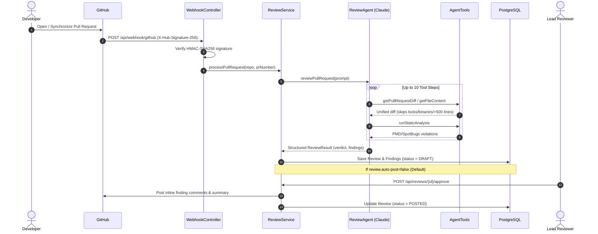

# 🛡️ CodeSentinel

**CodeSentinel** is an autonomous AI agent built in Java 21 and Spring Boot 3.x that automatically reviews GitHub Pull Requests, performs PMD/SpotBugs static analysis, identifies security and code health issues, and posts inline review comments and summary verdicts back to GitHub.

---

## 🌟 Architecture & Workflow



---

## 🚀 Tech Stack

- **Java**: Version 21 (LTS)
- **Framework**: Spring Boot 3.3.4 (Web, Spring Data JPA, Validation)
- **AI Agent Framework**: [LangChain4j](https://github.com/langchain4j/langchain4j) (`langchain4j-anthropic` 0.35.0)
- **LLM**: Claude via Anthropic API (model: `claude-sonnet-5-5`)
- **GitHub Integration**: Kohsuke GitHub API (`org.kohsuke:github-api` 1.326)
- **Database**: PostgreSQL 16 with Hibernate JPA (H2 for local test profile)
- **Containerization**: Docker & Docker Compose multi-stage build

---

## 📁 Package Structure

```
com.codesentinel
├── agent
│   ├── AgentTools.java          # LangChain4j @Tool methods with guardrails
│   └── ReviewAgent.java         # LangChain4j AiService interface with system prompt
├── config
│   ├── AnthropicConfig.java     # Anthropic Claude & ReviewAgent bean configuration
│   └── GitHubConfig.java        # Kohsuke GitHub client bean configuration
├── controller
│   ├── ReviewController.java    # REST API for inspection & review approvals
│   └── WebhookController.java   # GitHub webhook receiver & HMAC-SHA256 verification
├── model
│   ├── Finding.java             # JPA entity for individual code findings
│   ├── Review.java              # JPA entity for complete pull request review
│   ├── ReviewFinding.java       # DTO for structured findings
│   ├── ReviewResult.java        # Structured agent response model
│   └── Severity.java            # CRITICAL, MAJOR, MINOR enum
├── repository
│   └── ReviewRepository.java    # Spring Data JPA repository
└── service
    ├── GitHubService.java       # GitHub API integration, diffs & comments
    ├── ReviewService.java       # Review orchestration, draft & approval flow
    └── StaticAnalysisService.java # PMD and SpotBugs style rule engine
```

---

## 🛠️ Agent Tools (`AgentTools`)

Every tool is annotated with LangChain4j `@Tool` and `@P` descriptors so Claude can select and execute them intelligently:

| Tool | Parameters | Description |
|---|---|---|
| `getPullRequestDiff` | `repo`, `prNumber` | Fetches changed files, commit metadata, unified diff patches, and notes files skipped per guardrails. |
| `getFileContent` | `repo`, `path`, `ref` | Fetches full file content at a git ref with 1-based line numbering. Skips files over 500 lines. |
| `runStaticAnalysis` | `code` | Executes PMD/SpotBugs style static checks for SQL injection, hardcoded secrets, resource leaks, etc. |
| `postReviewComment` | `repo`, `prNumber`, `file`, `line`, `body` | Adds an inline review comment on a specific line of code. Respects the auto-post guardrail. |
| `postReviewSummary` | `repo`, `prNumber`, `verdict`, `body` | Posts the overall review summary and verdict to the PR conversation. |

---

## 🛡️ Guardrails & Safety Controls

1. **Approval Workflow (`review.auto-post=false` by default)**:
   - When set to `false`, reviews are saved in PostgreSQL with status **`DRAFT`**. Comments are held back from GitHub until a human triggers `POST /api/reviews/{id}/approve`.
2. **File Size & Format Exclusions**:
   - Files exceeding **500 lines** are automatically skipped and noted in the review summary.
   - Package manager lock files (`package-lock.json`, `yarn.lock`, `pnpm-lock.yaml`, `Gemfile.lock`, `Cargo.lock`, `go.sum`, etc.) are skipped.
   - Binary files (`.png`, `.jpg`, `.pdf`, `.jar`, `.class`, `.exe`, etc.) are skipped.
3. **Execution Loop Protection**:
   - Tool calling is deterministically bounded to a **maximum of 10 steps** per review session.
4. **Resilient Error Handling**:
   - All tool methods catch exceptions and return informative diagnostic text to the model rather than crashing the agent loop.
5. **Zero Secret Leakage**:
   - Request and response logging on the Anthropic client is disabled (`logRequests(false)`).
   - API keys and tokens are never logged or exposed in responses.
   - Webhook signatures use constant-time `MessageDigest.isEqual` comparison to mitigate timing attacks.

---

## 🔑 Environment Variables

| Variable | Description | Required | Default |
|---|---|---|---|
| `ANTHROPIC_API_KEY` | Anthropic API key for Claude | Yes | — |
| `GITHUB_TOKEN` | GitHub Personal Access Token (classic or fine-grained) | Yes | — |
| `GITHUB_WEBHOOK_SECRET` | Secret configured on GitHub webhook for HMAC-SHA256 verification | Yes | — |
| `REVIEW_AUTO_POST` | Set to `true` to immediately post comments; `false` saves as DRAFT | No | `false` |
| `POSTGRES_DB` | PostgreSQL database name | No | `codesentinel` |
| `POSTGRES_USER` | PostgreSQL username | No | `codesentinel` |
| `POSTGRES_PASSWORD` | PostgreSQL password | No | `codesentinel` |
| `SERVER_PORT` | HTTP port for CodeSentinel application | No | `8080` |

Copy the provided [`.env.example`](file:///.env.example) file to `.env`:
```bash
cp .env.example .env
```

---

## 💻 Local Setup & Execution

### Prerequisites
- **Java 21** or later
- **Maven 3.9+** (or use the included `./mvnw`)
- **Docker & Docker Compose** (optional, for containerized run)

### 1. Build and Run Tests
```bash
# Run unit & integration tests
./mvnw clean test
```

### 2. Run Locally with Maven
```bash
# Set environment variables in your terminal
export ANTHROPIC_API_KEY="sk-ant-api03-..."
export GITHUB_TOKEN="ghp_..."
export GITHUB_WEBHOOK_SECRET="your_webhook_secret_123"
export REVIEW_AUTO_POST="false"

# Run Spring Boot app
./mvnw spring-boot:run
```

### 3. Run with Docker Compose
```bash
# Build and launch both PostgreSQL and CodeSentinel
docker-compose up --build -d

# View application logs
docker-compose logs -f app
```

---

## 🔗 Connecting a GitHub Webhook

### Step 1: Create a GitHub Personal Access Token (PAT)
1. Go to **GitHub** → **Settings** → **Developer settings** → **Personal access tokens** → **Tokens (classic)**.
2. Click **Generate new token (classic)**.
3. Select scopes:
   - `repo` (Full control of private repositories, or public repos)
   - `pull_requests:write` (if using fine-grained PAT)
4. Copy the generated token into `GITHUB_TOKEN`.

### Step 2: Configure the Repository Webhook
1. Navigate to your target repository on GitHub:
   - **Settings** → **Webhooks** → **Add webhook**.
2. Set the configuration:
   - **Payload URL**: `https://your-public-url.com/api/webhook/github`
   - **Content type**: `application/json`
   - **Secret**: Enter your secret string (matching `GITHUB_WEBHOOK_SECRET`).
   - **SSL verification**: Enable SSL verification.
3. Under **Which events would you like to trigger this webhook?**:
   - Choose **Let me select individual events**.
   - Check **Pull requests**.
   - (Optional) Check **Pings**.
4. Click **Add webhook**. GitHub will immediately send a `ping` event. CodeSentinel will verify the signature and respond with `200 OK` (`{"status": "pong"}`).

### Step 3: Local Webhook Forwarding (for Development)
If running locally behind NAT, use [smee.io](https://smee.io/) or [ngrok](https://ngrok.com/):
```bash
# Using smee.io:
npm install --global smee-client
smee -u https://smee.io/YOUR_SMEE_CHANNEL -t http://localhost:8080/api/webhook/github

# Or using ngrok:
ngrok http 8080
# Set Payload URL to: https://<ngrok-id>.ngrok-free.app/api/webhook/github
```

---

## 📡 REST API Reference

### 1. GitHub Webhook Receiver
- **Endpoint**: `POST /api/webhook/github`
- **Headers**:
  - `X-Hub-Signature-256`: `sha256=<hmac_hex>`
  - `X-GitHub-Event`: `pull_request` or `ping`
- **Response**:
  ```json
  {
    "status": "accepted",
    "repository": "octocat/Hello-World",
    "prNumber": 42,
    "action": "opened",
    "reviewId": 1,
    "reviewStatus": "DRAFT",
    "message": "Pull request review processed. Status: DRAFT"
  }
  ```

### 2. Approve a Draft Review
- **Endpoint**: `POST /api/reviews/{id}/approve`
- **Description**: Posts all findings as inline comments and the overall review summary to GitHub, then marks the review as `POSTED`.
- **Response**:
  ```json
  {
    "status": "success",
    "message": "Review approved and posted to GitHub successfully",
    "reviewId": 1,
    "repository": "octocat/Hello-World",
    "prNumber": 42,
    "reviewStatus": "POSTED",
    "findingsCount": 2
  }
  ```

### 3. List All Reviews
- **Endpoint**: `GET /api/reviews`
- **Query Parameters**:
  - `repository` (optional): Filter by repository name
  - `status` (optional): Filter by `DRAFT` or `POSTED`
- **Response**:
  ```json
  [
    {
      "id": 1,
      "repository": "octocat/Hello-World",
      "prNumber": 42,
      "commitSha": "6dcb09b5b57875f334f61aebed695e2e4193db5e",
      "verdict": "CHANGES_REQUESTED",
      "summary": "Found 1 critical SQL injection and 1 missing test case.",
      "status": "DRAFT",
      "skippedFiles": "package-lock.json",
      "createdAt": "2026-10-07T22:00:00",
      "postedAt": null,
      "findings": [
        {
          "id": 1,
          "file": "src/main/UserService.java",
          "line": 16,
          "severity": "CRITICAL",
          "explanation": "Direct string concatenation into SQL query produces SQL Injection.",
          "suggestedFix": "query.setParameter(\"username\", username);"
        }
      ]
    }
  ]
  ```

### 4. Get Review by ID
- **Endpoint**: `GET /api/reviews/{id}`
- **Response**: Returns the complete review object with findings list.

---

## 🧪 Testing with cURL

### Test Webhook Signature (Valid Payload):
```bash
PAYLOAD='{"action":"opened","pull_request":{"number":42,"title":"Test PR"},"repository":{"full_name":"octocat/Hello-World"}}'
SECRET="test_secret_123"
SIGNATURE=$(echo -n "$PAYLOAD" | openssl dgst -sha256 -hmac "$SECRET" | sed 's/^.* //')

curl -X POST http://localhost:8080/api/webhook/github \
  -H "Content-Type: application/json" \
  -H "X-GitHub-Event: pull_request" \
  -H "X-Hub-Signature-256: sha256=$SIGNATURE" \
  -d "$PAYLOAD"
```

### Approve Review #1:
```bash
curl -X POST http://localhost:8080/api/reviews/1/approve
```

### List Reviews:
```bash
curl -X GET http://localhost:8080/api/reviews
```
